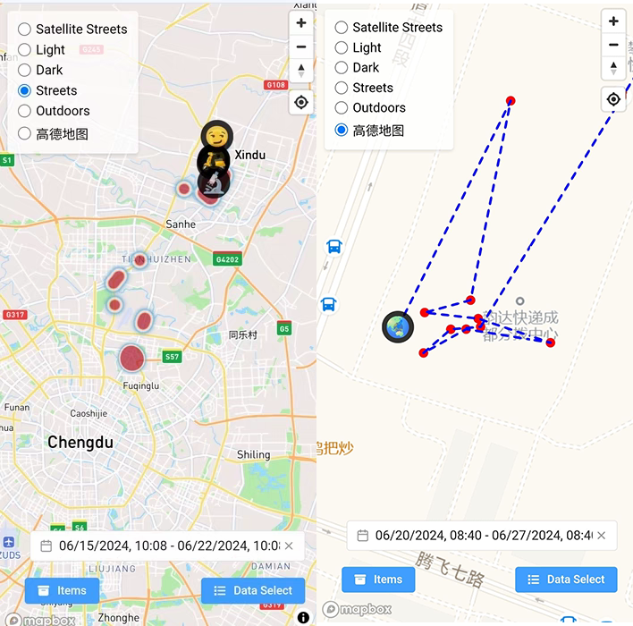

# NinjiaTag
## DIY Your Own Airtag
DIY a FindMy network-compatible tracking tag/device (long-term recording)
> "NinjiaTag" is not a typo—it represents our redefinition of IoT product value: not just an agile anti-loss tool (Ninja), but also a vision for next-gen distributed IoT technology, pioneering a new solution for distributed Bluetooth tags (Tag). The 'jia' in the name signifies 'collaborative home,' inviting you to co-build this future!

The server-side runs the FindMy network backend to capture location data and store it in a database. **No Mac/VM or iPhone with the Find My app is needed** to view historical locations of your DIY tags/devices across any timeframe (borrowing an iPhone for Apple ID registration is temporarily required).
Current features:
- [x] Server-side background execution of `request_report` to fetch and store location data indefinitely in a local server database (unlike mainstream products limited to 7 days). Trajectories are permanently saved.
- [x] Query and display trajectories for any item/timeframe. Supports latitude/longitude and timestamp display with zoom functionality for easy review.
- [x] Heatmap display (Hotspot), similar to GIS population density visualization—frequently visited areas appear darker.
- [x] Web frontend supports key management.
- [x] Uses open-source Mapbox-GL 3D engine for terrain rendering and aesthetics.

- [ ] *Pending testing*: Query Apple's Find My network, write to SQLite database, convert to tracks (KML/GPX, etc.).



## Table of Contents
- #ninjiatag
  - #diy-your-own-airtag
  - #table-of-contents
  - #hardware-diy
  - #prerequisites
  - #hardware-setup
  - #server-side-installation--deployment
    - #1-create-a-docker-network
    - #2-run-anisette-server
    - #3-download-this-project-locally
    - #4-place-server-keys
    - #5-install-python3-libraries
      - #core-networking--encryption-components
      - #create-a-python3-venv-virtual-environment-optional
        - #install-dependencies-in-venv
    - #install-nodejs
    - #install-pm2-for-daemonized-execution
      - #pm2-installation-notes
      - #pm2-long-running-script-commands
        - #start-scripts--name-processes
        - #long-run-safeguards
        - #common-pm2-commands-ignore-during-deployment
    - #6-server-backend-address-remote
  - #frontend-page
    - #usage
      - #basic-usage-guide
  - #based-on-open-source-projects
  - #miscellaneous-under-development-convert-data-to-kml
  - #disclaimer


## Prerequisites
- A **Linux server** (any distro) to run Docker and Python scripts.
- An **Apple ID** with **2FA (SMS only)** enabled, registered using a physical iOS device (iPad/iPhone/Mac).
  - *Recommendation:* Create a *new* Apple ID for testing. Log out of this ID on any Apple devices to ensure SMS codes work.
  - The account *must* have been logged into on an Apple device (to activate iCloud's free 5GB space). Web-only registrations lack permissions.
- A **Bluetooth tag device**: Currently supports nRF5x & ST17H66 modules. Support for more low-cost domestic modules is planned.
  - Minimal system modules suffice. You can also design PCBs using nRF5x/ST17H66 chips.

## Hardware Setup
1.  **Download Firmware & Flashing Scripts**
    - **ST17H66 Chips**: Visit https://github.com/biemster/FindMy/tree/main/Lenze_ST17H66 for firmware (`FindMy.hex`) and script (`flash_st17h66.py`).
    - **nRF5x Chips**: Visit https://github.com/acalatrava/openhaystack-firmware/releases for firmware (`nrf51_firmware.bin` or `nrf52_firmware.bin`).
    - *Experimental:* https://github.com/biemster/FindMy/blob/main/Telink_TLSR825X/README.md (e.g., Xiaomi Temp/Humidity Sensor 2 - Model LYWSD03MMC).

2.  **Generate Key Pairs**: Run `python3 generate_keys.py` in this repo's `keygen` directory (outputs to a random 6-character folder).  
    *Dependencies:* Install `cryptography` & `filelock` via `pip3 install cryptography filelock`. Works on Windows/Linux.  
    - **Multi-Key Support**: Run `python3 generate_keys.py -n 50 -i 8` to generate 8 items with 50 rolling keys each. Rolling keys (like AirTag) improve location update frequency and accuracy but increase power consumption slightly.

3.  **Flash Firmware to Device**
    - flash_guide/nrf5x.md
    - flash_guide/ST17H66.md

## Server-Side Installation & Deployment
### 1. Create a Docker Network
```bash
docker network create mh-network
```

### 2. Run https://github.com/Dadoum/anisette-v3-server
```bash
docker run -d --restart always --name anisette -p 6969:6969 --volume anisette-v3_data:/home/Alcoholic/.config/anisette-v3/ --network mh-network dadoum/anisette-v3-server
```
**Note for China Users**: Configure Docker registry mirrors by editing `/etc/docker/daemon.json` (create if missing):
```json
{
  "registry-mirrors": [
      "https://docker.1ms.run",
      "https://hub.1panel.dev",
      "https://docker.itelyou.cf",
      "http://mirrors.ustc.edu.cn",
      "http://mirror.azure.cn"
  ]
}
```
Restart Docker:
```bash
systemctl restart docker  # or `service docker restart`
```
Verify with `docker info` (look for `Registry Mirrors`).

### 3. Download This Project Locally
Use `git clone` or download the ZIP.

### 4. Place Server Keys
Place the `.key` files generated in #hardware-setup into the project's `/key` folder. Scripts will auto-convert them.

### 5. Install Python3 Libraries
#### Core Networking & Encryption Components
```bash
pip3 install aiohttp requests cryptography pycryptodome srp pbkdf2 -i https://pypi.tuna.tsinghua.edu.cn/simple
```
#### Create Python3 venv (Optional)
Skip if dependencies installed successfully above.
```bash
python3 -m venv ./venv/
```
##### Install Dependencies in venv
```bash
./venv/bin/pip3 install aiohttp requests cryptography pycryptodome srp pbkdf2 -i https://pypi.tuna.tsinghua.edu.cn/simple
```
**Run Script**:
```bash
./venv/bin/python3 request_reports.py  # or `python3 request_reports.py`
```
*First run prompts for Apple ID/Password + 2FA SMS.*

### Install Node.js
```bash
# Download and install nvm:
curl -o- https://raw.githubusercontent.com/nvm-sh/nvm/v0.40.3/install.sh | bash
\. "$HOME/.nvm/nvm.sh" # Activate nvm without restarting shell
# Download and install Node.js:
nvm install 22
# Verify:
node -v  # Should output v22.17.1
npm -v   # Should output 10.9.2
```
**Install Project Dependencies**:
```bash
npm i
```

### Install PM2 for Daemonized Execution
Run `server.mjs` (DB query service) and `request_reports.mjs` (location fetch task) persistently.
#### PM2 Installation Notes
1.  Install globally via npm:
```bash
npm install pm2 -g
```
Verify with `pm2 --version`.

#### PM2 Long-Running Script Commands
##### Start Scripts & Name Processes
- Start DB Query Service:
```bash
pm2 start server.mjs --name "query-server" --watch
```
- Start Location Fetch Task:
```bash
pm2 start request_reports.mjs --name "report-task" --watch
```
##### Long-Run Safeguards
1.  Save process list: `pm2 save`
2.  Enable auto-start on boot:
```bash
pm2 startup         # Generate startup script
sudo pm2 startup systemd  # For Linux systemd
pm2 save            # Link saved process list
```
3.  Log Management: `pm2 logs query-server`

##### Common PM2 Commands (Ignore During Deployment)
- List processes: `pm2 list`
- Stop process: `pm2 stop query-server`
- Restart process: `pm2 restart query-server`
- Monitor resources: `pm2 monit`
- Delete process: `pm2 delete query-server`

### 6. Server Backend Address (Remote)
Frontend accesses data via a URL like `http://server-ip:3000`.  

**For Public Access**: Expose your local service using:
- Router port forwarding + DDNS (if you have a public IP).
- **Reverse Proxy/Tunneling Tools**:
    - https://ngrok.com/
    - https://iepose.com/
    - https://www.zeronews.cc/ (Free tiers available)
    - https://console.hsk.oray.com/ (¥9.9 lifetime, 1GB free/month)
- **VPN Mesh**: Zerotier / Tailscale.
*(Detailed setup beyond this guide)*.

## Frontend Page
Use my hosted page or self-deploy:
- **Hosted Pages**:  
  http://bd8cca.atomgit.net/NinjiaTagPage/  
  https://bd8cca.atomgit.net/NinjiaTagPage/  
- **Self-Deploy Source**:  
  https://atomgit.com/bd8cca/NinjiaTagPage  

**Important Notes**:
1.  Browsers enforce HTTPS/CORS: HTTPS frontends *must* connect to HTTPS backends (requires SSL cert). Use tools like https://developers.cloudflare.com/cloudflare-one/connections/connect-networks/.
2.  Browsers may auto-redirect HTTP to HTTPS. Manually enter `http://` if needed.

### Usage
Vue3-based frontend using Mapbox-GL for powerful rendering (supports future features like KML export).

#### Basic Usage Guide
1.  **Configure Server Address**: In frontend settings, enter your server's address + `/query` suffix (e.g., `http://your-server-ip:3000/query`).
2.  **Import Keys**: Use the `Item Management` dialog to "Parse JSON Key File" (the `.json` from `generate_keys.py`).
3.  **Query Data**: In the `Data Selection` dialog:
    - *Trajectory Points*: Historical path. Hover/click for details.
    - *Heatmap*: Density visualization (darker = more visits).
    - *Latest Location*: Most recent position (icon).
**No Data?** Carry your NinjiaTag to a crowded area and wait for the server to populate the DB.

## Based on Open-Source Projects
- Core FindMy functionality modified from https://github.com/seemoo-lab/openhaystack/.
- Server-side deployment simplified by https://github.com/JJTech0130/pypush.
- Android APK localization by https://gitee.com/lovelyelfpop/macless-haystack.

## Miscellaneous (Under Development): Convert Data to KML
*KML (Keyhole Markup Language) displays geographic data in Earth browsers (e.g., Google Earth).*
```bash
./request_reports.py > input.txt  # Generate JSON-like data
python3 make_kml.py              # Reads input.txt, outputs *.kml files per key
```

## Disclaimer
**This repository is for research purposes only. You are responsible for your use of this code.**

I assume no liability for how you utilize any source code provided here. Using any files from this repository implies you accept all associated risks. **All files are provided solely for educational and/or research purposes.** This project is intended **only for item loss prevention**. **Misuse for illegal activities is strictly prohibited.** Always comply with local laws and regulations.