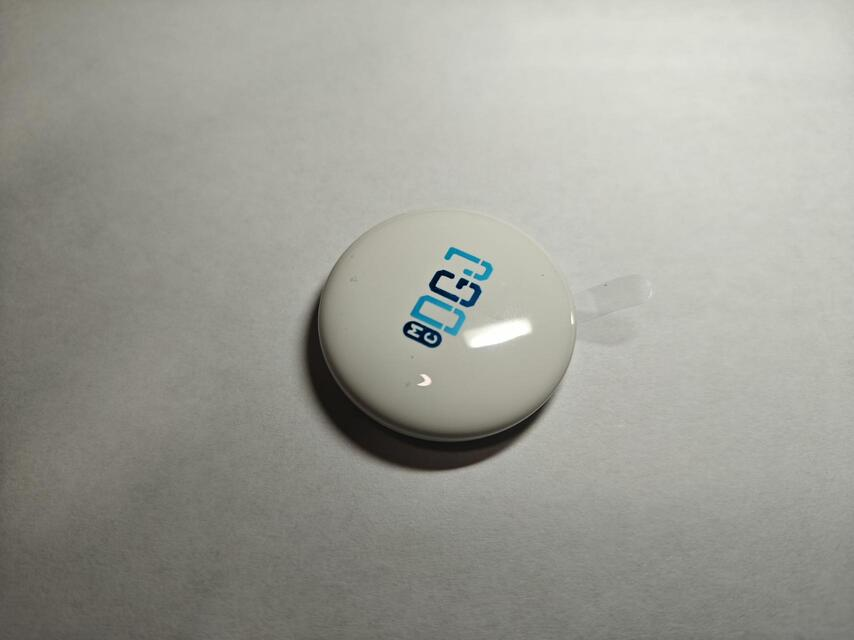
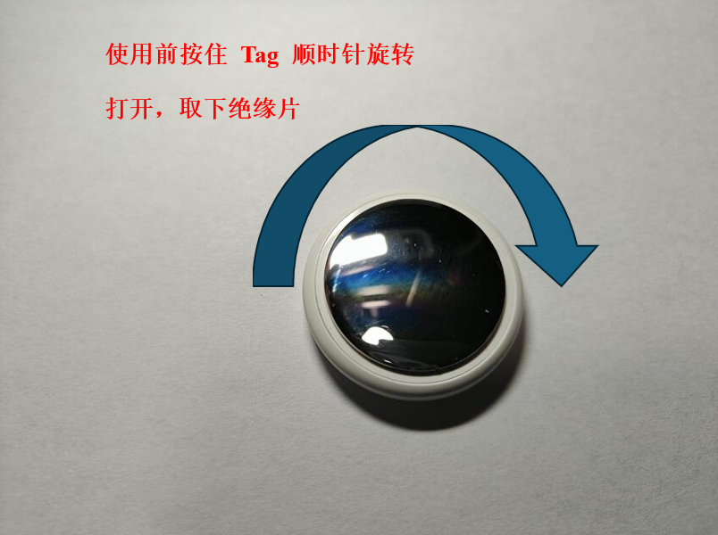
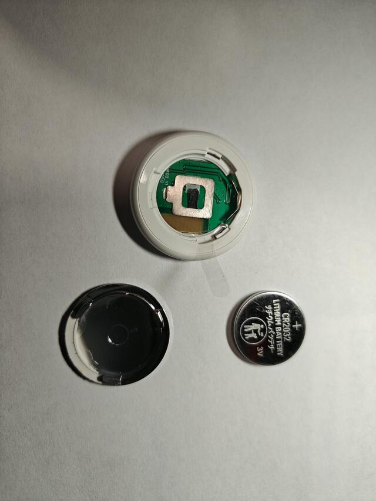
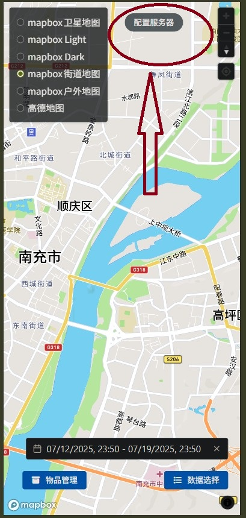
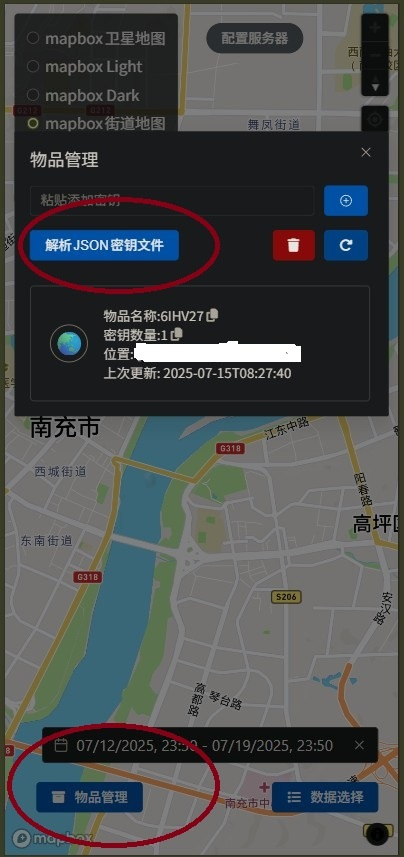
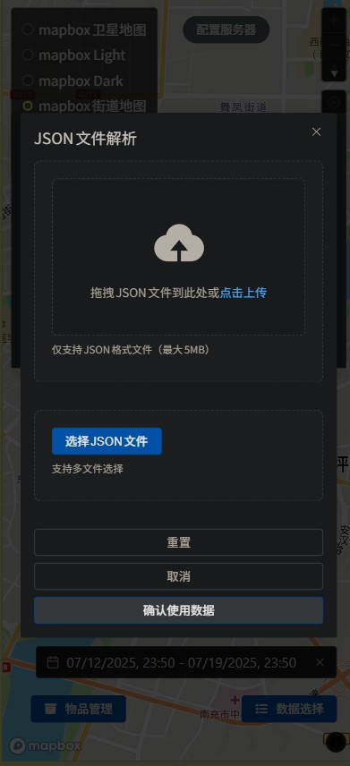

## 2032 Tag 使用方法

从包装盒取出 tag

按住 Tag 外壳，顺时针旋转取下后盖

取出绝缘片

按相反步骤装回电池（电池正极一面朝外）以及后盖

装回后盖前可能需要清理一下盖子及连接处的残胶，便于装回

孔位对齐，按住 Tag 后盖，逆时针旋转后盖拧紧，如果不好装可能要稍微调整一下姿势，感到有一个明显的旋转角度后，盖子不脱开就装好了。

## NinjiaTag Web 端使用教程

打开浏览器，访问[NinjiaTagPage](https://bd8cca.atomgit.net/NinjiaTagPage/)，建议收藏页面或添加到桌面图标方便访问

## 配置服务器地址

以手机网页端为例，在页面右上角有一个配置服务器按钮，输入你自己部署的数据查询服务 url 地址" 形如 `http://服务器ip:3000/query` 或使用我发给你的服务器地址填入，保存。

## 导入物品配置

使用我提供的服务器，建议通过粘贴序列号添加物品
自建服务器通过导入 JSON 配置文件添加物品

### 粘贴序列号添加（使用我的服务器）

如果使用我提供的服务器地址（自建服务器不支持该方法），可以直接扫码包装盒或物品包装袋上的序列号二维码添加物品，建议使用微信扫一扫二维码，将扫描结果完整复制到输入框中点击加号添加

包装上的序列号形式如下，使用微信扫一扫(也可以使用相机或其他扫码工具)扫描后长按扫描结果复制到剪贴板,点击页面左下角“物品管理”按钮，在“粘贴序列号或 JSON 密钥添加”对话框中粘贴，点击后面的＋号添加

在“物品管理”对话框，点刷新按钮，如果能出现最新更新日期，则说明能正常获取到位置数据。
如果没有获取到或显示空，则需要带着 Tag 到人流量大的地方走一圈，等待后台数据刷新。

### 导入 JSON 配置文件添加 (自建服务器的情况)

如果自建服务器，需要导入 JSON 配置文件

点击页面左下角“物品管理”按钮，在弹出的对话框中，选择解析 JSON 密钥文件按钮

在弹出的对话框中，上传.json 后缀的密钥文件（这个文件是我提供给你的文件里面的"\_devices.json"后缀文件，或者由你自己烧录固件时生成）

上传完成，在对话框最下面选择“确认使用数据”保存密钥

在“物品管理”对话框，点刷新按钮，如果能出现最新更新日期，则说明能正常获取到位置数据。
如果没有获取到或显示空，则需要带着 Tag 到人流量大的地方走一圈，等待后台数据刷新。

## 选择物品并查询轨迹

点击主页面右下角`数据选择`按钮，在对话框选择物品数据和时间段进行查询，有几个选项：

- 轨迹点：历史的轨迹，鼠标悬停或点击可显示详情。

- 热图： 类似地理信息系统的人流密度显示，经常去过的地方颜色更深，不去或偶尔去的地方颜色浅。
- 最新位置： 最新的物品位置，以图标的形式显示。

如果没有获取到位置数据，带着 diy 的 NinjiaTag 到人流密集的地方走一圈，等待后台服务器获取到位置数据库并存入数据库。
